# Final Architecture Report Figure

This file documents the report-level architecture figure used in Chapter 4. The polished editable source is stored as `thesis/MiunThesisTemplate-master/MiunThesisTemplate-master/Figures/final-architecture-report.svg`, and the LaTeX build includes the exported PNG at `thesis/MiunThesisTemplate-master/MiunThesisTemplate-master/Figures/final-architecture-report.png`.

The Mermaid version below mirrors the same architecture content for lightweight documentation. It is intentionally simpler than the hand-written SVG, which contains the icon-like visual styling used in the report.

```mermaid
flowchart LR
  subgraph InputZone["Input / event"]
    A["Temperature event / test input"]
  end

  subgraph PC["PC-hosted workflow runtime"]
    B["PC-hosted Docker n8n"]
    C{"Workflow decision"}
    D["Deterministic baseline"]
    E["Minimal agent-enhanced workflow"]
    B --> C
    C --> D
    C --> E
  end

  subgraph BoundaryZone["Contract / validation"]
    F["JSON contract + validation boundary"]
  end

  subgraph MW["Middleware endpoint"]
    G["Python middleware API"]
    H["/fan/on or /fan/off<br/>simulated fan action"]
    G --> H
  end

  subgraph EvalZone["Evaluation artifacts"]
    I["CSV results and metrics"]
  end

  subgraph PI["Raspberry Pi middleware validation"]
    J["Raspberry Pi middleware/action endpoint"]
    L["Validation evidence<br/>HTTP call and metrics"]
    J --> L
  end

  A --> B
  D --> F
  E --> F
  F --> G
  G --> I
  B -. "HTTP over network" .-> J
  L -. "validation evidence" .-> I

  K["Note: fan action is simulated; Raspberry Pi validation runs the middleware/action endpoint, not n8n."]
  H -.-> K

  classDef input fill:#ffffff,stroke:#64748b,stroke-width:1px,color:#111827;
  classDef runtime fill:#eaf3ff,stroke:#2563eb,stroke-width:1px,color:#111827;
  classDef decision fill:#ffffff,stroke:#64748b,stroke-width:1px,color:#111827;
  classDef boundary fill:#fff7e6,stroke:#b26b00,stroke-width:1px,color:#111827;
  classDef action fill:#eef7ff,stroke:#1f77b4,stroke-width:1px,color:#111827;
  classDef evidence fill:#eef8e8,stroke:#4d7c0f,stroke-width:1px,color:#111827;
  classDef note fill:#f8fafc,stroke:#64748b,stroke-dasharray: 4 3,color:#334155;

  style InputZone fill:#f8fafc,stroke:#334155,stroke-width:1px;
  style PC fill:#f8fafc,stroke:#334155,stroke-width:1px;
  style BoundaryZone fill:#f8fafc,stroke:#334155,stroke-width:1px;
  style MW fill:#f8fafc,stroke:#334155,stroke-width:1px;
  style EvalZone fill:#f8fafc,stroke:#334155,stroke-width:1px;
  style PI fill:#f8fafc,stroke:#334155,stroke-width:1px;

  class A input;
  class B,J runtime;
  class C,D,E decision;
  class F boundary;
  class G,H action;
  class I,L evidence;
  class K note;
```

**Caption:** Report-level architecture of the implemented workflow-to-action system. The n8n workflow runs on the PC, action requests pass through a JSON contract and validation boundary, and the Python middleware exposes simulated fan actions. Raspberry Pi validation covers the middleware/action endpoint side over the network.

The detailed implementation diagram remains available in `docs/architecture/final-architecture.md` and `docs/architecture/final-architecture.mmd` for appendix or internal evidence use.
