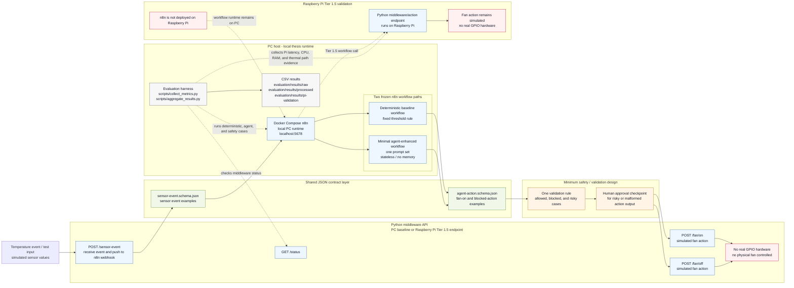

# Final Architecture - Frozen Tier 1.5

**Caption:** Frozen Tier 1.5 architecture for the final thesis implementation. The diagram shows the temperature-event path, PC-hosted Docker n8n workflows, shared JSON contracts, minimum safety/validation boundary, Python middleware endpoints, evaluation harness, and Raspberry Pi validation split.

This is the final frozen architecture used for Chapter 5. It represents the narrowed new-yacoub implementation state after the implementation freeze: one deterministic baseline workflow, one minimal agent-enhanced workflow, one shared contract boundary, one minimum safety/approval design, and one measurable evaluation loop.

The Raspberry Pi part represents Tier 1.5 validation only. n8n remains deployed on the PC through Docker, while the Python middleware/action endpoint can run on the Raspberry Pi for validation evidence. This is not a full n8n-on-Pi deployment, and the fan action remains simulated with no real GPIO hardware or physical fan control.
