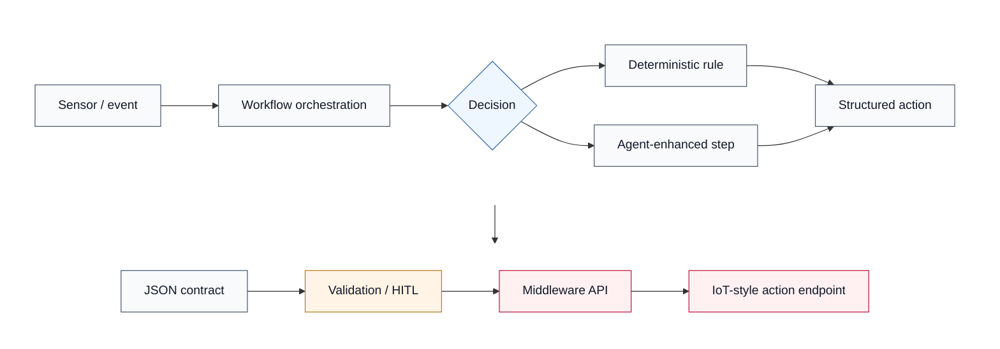

# Theory Background Flow

**Purpose:** This is a compact conceptual theory/background diagram for Chapter 2. It shows the general event-to-action pattern used in the thesis: sensor or event input, workflow orchestration, deterministic or agent-enhanced decision, structured action output, JSON contract, validation/HITL boundary, middleware/API boundary, and IoT-style action endpoint.

**Caption for thesis:** Conceptual event-to-action pattern used to frame the thesis. Sensor input is handled by workflow orchestration, converted into a deterministic or agent-enhanced action, checked through a contract and validation boundary, and routed through middleware before reaching an IoT-style endpoint.

This is not the final architecture diagram and not runtime evidence. It is intended to support the theory and related-work discussion.
